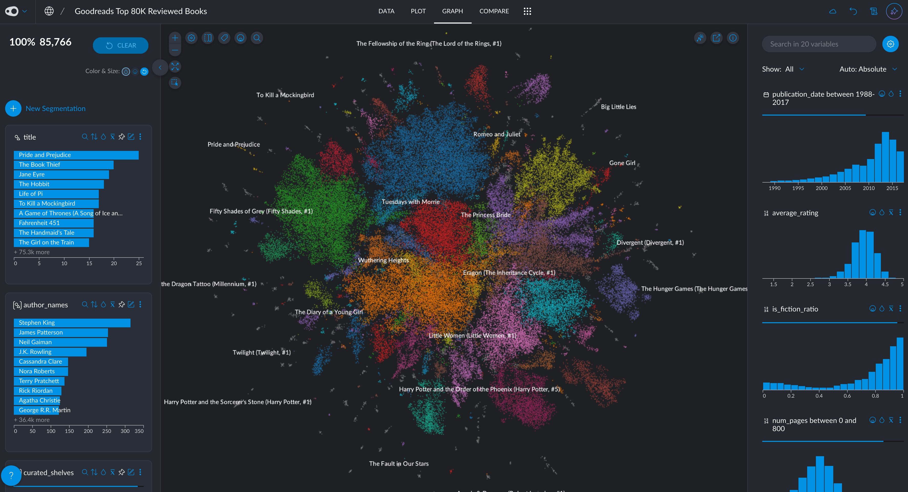

# Goodreads Books Dataset Converter

This project provides tools to download and convert the Goodreads Books Dataset from the [UCSD Book Graph](https://mengtingwan.github.io/data/goodreads.html#datasets) into Parquet format for efficient data analysis.

You can check the final result in [Graphext](https://graphext.com) and play with the data (if you have a free Graphext account) [here](https://app.graphext.com/projects/UHJvamVjdC0xMDg3MTY=/v/data
) or [here](https://public.graphext.com/ea0a53d84f0facda/index.html) if don't have an account. 



The visualization above shows the relationships between the top 80,000 most reviewed books on Goodreads. Each cluster represents books with similar characteristics based on their multiple genres. Notable clusters include fantasy series like "The Lord of the Rings", classic literature like "Pride and Prejudice", and modern bestsellers like "The Hunger Games".

## Basic Usage

#Download needed assets from the web
main.py --step download --dataset all
* goodreads_books.json (~8GB when decompressed)
* goodreads_book_authors.json

#Create custom genres index
analyze_shelves.py --input goodreads_books.parquet --output classified_shelves.parquet --top-n 1000 --classify --openai-api-key "your-api-key"

#Filter original dataset down to only top books more reviews
filter_books.py --min-reviews 1000

#Transform filtered books to map authors, genres, similar books, format publication date and select and reorder columns, 
transform_books.py --input filtered_books.parquet --output enriched_books.parquet

## Dataset Information

The complete dataset contains:
- 2,360,655 books (1,521,962 works, 400,390 book series, 829,529 authors)
- 876,145 users
- 228,648,342 user-book interactions

This tool can download and process these dataset files:
- `goodreads_books.json.gz` (~2GB compressed) - Detailed information about 2.3M books
- `goodreads_book_authors.json.gz` - Detailed information about authors
- `goodreads_book_genres_initial.json.gz` - Book genres extracted from user shelves

## Requirements

- Python 3.6+
- Required packages (install using `uv pip install -r requirements.txt`):
  - requests
  - tqdm
  - pandas
  - pyarrow
  - ijson
  - polars


## Advanced Usage

1. Install dependencies:
```bash
uv pip install -r requirements.txt
```

2. Run the pipeline using one of these options:

Download specific dataset (choices: books, authors, genres, all):
  
```bash
uv run main.py --step download --dataset books
uv run main.py --step download --dataset authors
uv run main.py --step download --dataset genres
uv run main.py --step download --dataset all
```

- Convert to Parquet only (requires JSON file to be present):
```bash
uv run main.py --step convert --dataset books
```


- Run complete pipeline (download and convert):
```bash
uv run main.py --step all --dataset books
```

## Filtering Books

After converting to Parquet format, you can filter the books based on various criteria using the `filter_books.py` script:

### Basic Usage

Filter books with at least 1000 reviews (default):
```bash
uv run filter_books.py
```

Customize the filtering with various options:
```bash
uv run filter_books.py --min-reviews 5000
```

```bash
uv run filter_books.py --min-reviews 1000 --min-avg-rating 4.0
```

Create Index of Shelves
```bash
uv run analyze_shelves.py --input goodreads_books.parquet --output popular_shelves.parquet --top-n 1000
```

Classify shelves into "genre", "reading_status", "year_list", "other"
```bash
uv run analyze_shelves.py --input goodreads_books.parquet --output classified_shelves.parquet --top-n 1000 --classify --openai-api-key "your-api-key"
```

Transform filtered books
```bash
uv run transform_books.py
uv run transform_books.py --input filtered_books.parquet --output enriched_books.parquet
```

## Output Files

### Downloaded JSON files:
- `goodreads_books.json` (~8GB when decompressed)
- `goodreads_book_authors.json`
- `goodreads_book_genres_initial.json`

### Converted Parquet files:
- `goodreads_books.parquet`: Final Parquet file containing the converted books data

## Data Processing

The conversion process:
1. Downloads the compressed JSON files from UCSD's repository
2. Decompresses the gzipped files
3. Processes the JSON data in chunks of 100,000 records
4. Flattens nested structures (authors and popular_shelves)
5. Converts to Parquet format with optimized storage

## Data Structure Modifications

The converter makes these modifications to the original JSON structure:
- `popular_shelves`: Converted from array of objects to array of shelf names
- `authors`: Converted from array of objects to array of author IDs
- All other fields are preserved as is

## License

This code is provided under MIT License. However, please note that the dataset itself has its own terms of use as specified on the [dataset website](https://mengtingwan.github.io/data/goodreads.html#datasets):
- For academic use only
- Do not redistribute
- No commercial use

## Acknowledgments

Dataset provided by:
- UCSD Book Graph Project
- Authors: Mengting Wan and Julian McAuley
- Website: [Goodreads Datasets](https://mengtingwan.github.io/data/goodreads.html#datasets)
